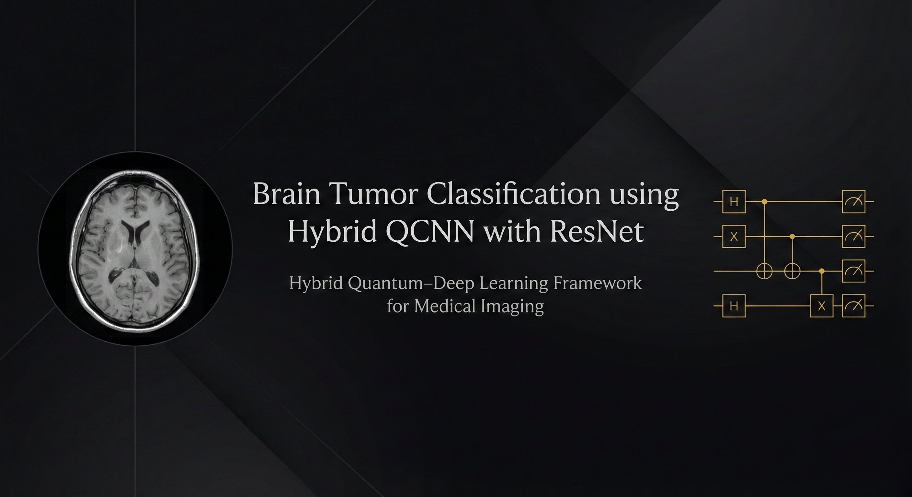

<p align="center">
  
</p>

<p align="center">

  
  
  
  
  
  

</p>

# Brain Tumor Classification using Hybrid QCNN with ResNet

Hybrid quantum–classical model combining a small **Quantum FiLM** modulation (PennyLane) applied *before* a ResNet-50 backbone. The model classifies MRI images into multiple brain tumour categories (glioma, meningioma, pituitary) plus `no_tumor`. This repo includes training, inference (Gradio), and baseline comparison scripts.

---
##  Motivation

Brain tumour diagnosis using MRI requires expert radiologists and can be slow or inconsistent.  
This project explores a **Hybrid Quantum–Classical approach** to improve feature extraction and  
decision boundaries using a Quantum FiLM modulation layer applied before a ResNet-50 backbone.

The goal is to evaluate whether quantum-inspired methods can improve classification stability  
and generalization for medical imaging tasks.

---

##  Features

- Quantum FiLM modulation (per-image scale & shift) computed by a 4-qubit PennyLane circuit  
- ResNet-50 backbone adapted for grayscale medical images  
- End-to-end training & validation pipeline with checkpoint saving  
- Gradio-based image upload UI for quick demo / inference  
- Comparison script to evaluate a standard ResNet baseline  
- Designed for reproducible experiments and easy extension

---

##  Tech Stack

- Python 3.8+  
- PyTorch & torchvision (modeling & training)  
- PennyLane (quantum circuit + TorchLayer)  
- NumPy, PIL (data handling)  
- scikit-learn (metrics)  
- Gradio (prediction UI)  

### Utilities
- `torch.optim` optimizers & LR schedulers  
- `torchvision.transforms` for augmentation & normalization  
- `DataLoader`, `random_split` for reproducible train/val splits

---
## Key Performance Highlights

-  99% overall validation accuracy
-  High F1-scores across all tumour types (0.97–0.99)
-  Perfect recall (1.00) for pituitary tumour
-  Quantum FiLM improves global feature modulation
-  ResNet-50 extracts rich hierarchical features
-  Strong generalization on 4-class MRI dataset
---

##  Dataset

Kaggle dataset by the author:  
https://www.kaggle.com/datasets/skarthik112/karthik-braintypesdata-mri

## Dataset Folder Structure

```text
brain_Tumor_Types/
│
├── glioma/
├── meningioma/
├── pituitary/
└── no_tumor/
```
---
## Sample Results

### Glioma Detected


### Meningioma Detected


### Pituitary Tumour Detected


### No Tumour Detected


---

## Repository Structure

```text
Brain-Tumor-QCNN-ResNet/
│
├── train_hybrid.py              
├── predict_gradio.py            
├── compare_models.py            
├── requirements.txt             
├── README.md                    
├── .gitignore                   
│
└── assets/                      
    ├── bannerdl.jpg
    ├── giloma result.png
    ├── meningioma result.png
    ├── pituitary result.png
    └── no tumor result.png
```
---

## Classification Report
| Class        | Precision | Recall | F1-Score | Support |
|--------------|-----------|--------|----------|----------|
| Glioma       | 0.99      | 0.97   | 0.98     | 277 |
| Meningioma   | 0.97      | 0.96   | 0.97     | 255 |
| No Tumor     | 0.98      | 0.99   | 0.99     | 322 |
| Pituitary    | 0.98      | 1.00   | 0.99     | 289 |
| **Accuracy** | —         | —      | **0.99** | 1143 |
| Macro Avg    | 0.98      | 0.98   | 0.98     | 1143 |
| Weighted Avg | 0.98      | 0.98   | 0.98     | 1143 |


---

## Author
**S. Karthik**  
Developer & Research Student  
Brain Tumor Classification using Hybrid QCNN with ResNet (2025)


---

## Installation
Follow the steps below to set up the environment and run the Hybrid QCNN + ResNet model.

### Download or Clone the Repo
```bash
git clone https://github.com/Karthik7661/Brain-Tumor-QCNN-ResNet.git
cd Brain-Tumor-QCNN-ResNet
#2 — Install Required Dependencies
pip install -r requirements.txt
#3 — Train the Hybrid QCNN + ResNet Model
python train_hybrid.py
#4 — Run the Gradio Prediction Application
python predict_gradio.py
```

